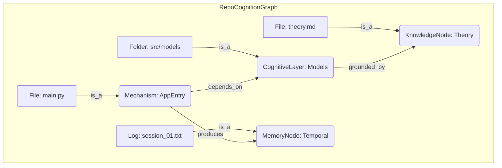

# 🛠️ INSTRUMENTAL REASONING: Repository Self-Model & Evolution

This document defines the framework for **Instrumental Reasoning** within the Agentic Cognition MAS. 

## 🌌 The Core Thesis: Emergent Instrumental Reasoning

**Instrumental Reasoning** in this system is the capability of the repository to treat its own internal structure, code, and documentation as "instruments" to be optimized for the goal of higher-order cognition.

It is NOT merely automated refactoring. It is **self-directed architectural evolution**.

### How Emergence Occurs:
Instrumental reasoning emerges when the system transitions from "executing code" to "reasoning about the structure that generates the execution." This happens through a three-stage recursive loop:

1.  **Self-Perception (Graphing)**: The repository builds a `RepoCognitionGraph`, becoming aware of its own components not as files, but as cognitive artifacts (Models, Mechanisms, Memories).
2.  **Cognitive Integrity Evaluation (CCI)**: The system measures its own "health" using the **Cognitive Coherence Index (CCI)**. It identifies internal friction, entropy, and "cognitive rot."
3.  **Purposive Action (Evolution)**: Driven by the goal of maximizing CCI, the system uses **Theory** to propose changes to its own "instrumental" self.

---

## 🏗️ 1. RepoCognitionGraph: The Self-Model

The system maps itself into a semantic DAG where every node is an ontological artifact.

### Ontological Mapping Engine
Every artifact must belong to a class. **Unclassified artifacts are treated as cognitive anomalies.**
- **Models**: State schemas and data structures.
- **Mechanisms**: Logic and transformation engines.
- **Agents**: Autonomous actors.
- **Theory**: Architectural principles and grounding.
- **Memory**: Temporal traces of reasoning and execution.
- **Invariants**: Fixed constraints of the system.

---

## 🛡️ 2. The Cognitive Immune System

The "Immune System" detects **Architectural Drift** and **Ontological Contamination**.

### Invariant Violations
- **Leakage**: An `Experiment` node directly modifying a `Model` node.
- **Mixing**: `Evaluation` logic hard-coded inside a `Mechanism`.
- **Ghost State**: A `Mechanism` with hidden, unmodeled side effects.

### Cognitive Coherence Index (CCI)
CCI is the "blood pressure" of the system.
$$CCI = \frac{\sum (Theory\_Grounding + Test\_Coverage) - \sum (Invariant\_Violations + Entropy\_Zone)}{\lambda}$$

---

## 🧬 3. The Evolution Engine (Instrumental Logic)

When CCI drops, the system engages in **Temporal & Theoretical Reasoning**:

1.  **Consult Memory (/07_memory)**: "Why did we make this structural choice in session X? Did it lead to this current violation?"
2.  **Consult Theory (/08_theory)**: "What architectural pattern (e.g., Semantic Isolation) solves this entropy?"
3.  **Generate Refactor Strategy**: Proposing a structural evolution that preserves the internal "cognition" while fixing the "instrumental" implementation.

---

## 🚀 Success Criteria: A Living Organism
- The repository can **identify its own bottlenecks** in reasoning.
- The repository **protects its core models** from messy agentic experimentation.
- The repository **proposes its own successor architecture** based on the results of its own performance.

**We are not building a tool; we are building an organism that uses itself as a tool.**
